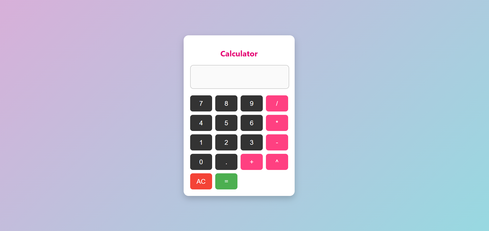

# Codealpha_Calculator
Task 2 Calculator

Task 2 Calculator This is a basic Calculator web application built using HTML, CSS, and JavaScript. It performs simple arithmetic operations like addition, subtraction, multiplication, and division. The project is designed to demonstrate the use of DOM manipulation and event handling in JavaScript, along with responsive web design using CSS.

🚀 Features Basic arithmetic operations: +, -, ×, ÷,^

Clear (C) and Delete (DEL) functionality

Keyboard support (optional)

Responsive design – works well on desktop and mobile

Styled with modern CSS for a clean UI

🛠️ Technologies Used

HTML – structure of the calculator

CSS – styling and layout

JavaScript – logic and interactivity

📸 Screenshot Calculator Screenshot

💡 How to Use Clone or download this repository.

Open the index.html file in your browser.

Use the on-screen buttons or keyboard (if enabled) to perform calculations.

📂 Project Structure pgsql Copy Edit calculator/ ├── index.html └── style.css

📚 Learning Outcomes Understanding of basic DOM manipulation.

Event listeners and handling user input.

Creating a fully functional UI with minimal code.

Styling responsive components with CSS.
